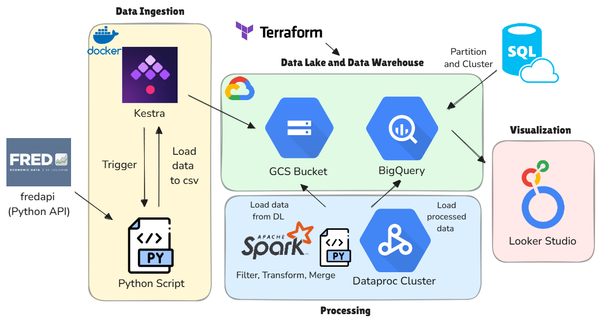
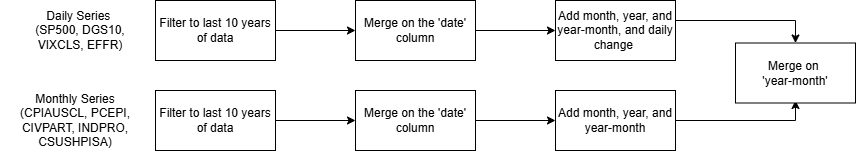
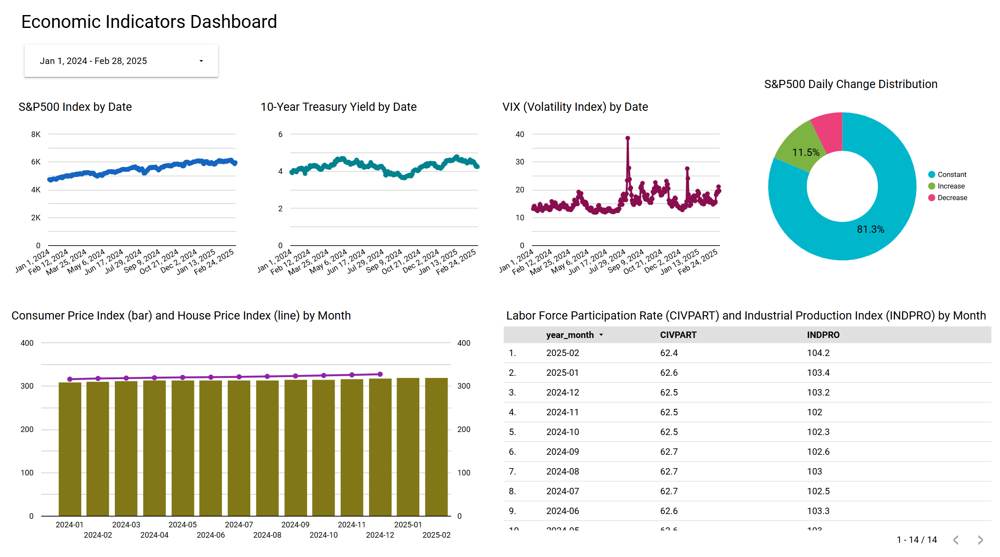

# EcoPulse: End-to-End Data Pipeline for Economic Insights

## Project Overview

**EcoPulse** is a cloud-native data engineering project designed to analyze key economic indicators through an **end-to-end batch data pipeline**. The pipeline automates the ingestion, processing, and storage of economic data in a structured, query-optimized format. This solution provides seamless analysis through an interactive dashboard, enabling data-driven decision-making across industries such as finance, policy, and business strategy.

## 🎯 Problem Statement

In today's fast-paced world, monitoring and analyzing key economic indicators—such as stock market, inflation, housing prices, and so on— is critical for making informed decisions in finance, policymaking, and business. However, gathering this data can often be a tedious and time-consuming task, especially when relying on manually pulling information from various sources.

To address this problem, **EcoPulse** automates the workflow by:
1. Extracting economic data from the **Federal Reserve Economic Data (FRED) Python API**.

2. Storing raw data in **GCS as a data lake**.

3. Processing data with **Apache Spark** on Dataproc.

4. Storing structured, partitioned, and clustered data in **BigQuery** for analytics.

5. Visualizing insights through an interactive dashboard in **Looker Studio**.

Here are the key economic indicators processed:

- **Financial Markets**: S&P 500 Index, 10-Year Treasury Yield, VIX (Volatility Index)
- **Interest Rates**: Federal Funds Rate
- **Inflation & Price Levels**: Consumer Price Index (CPI-U)
- **Labor Market**: Labor Force Participation Rate
- **Economic Activity**: Industrial Production Index
- **Housing Market**: House Price Index (Case-Shiller National Home Price Index)

## 🏗️ Architecture and Highlights



### Solution Highlights:

✅ **Cloud-Native & Infrastructure as Code (IaC)**: leverages cloud-based services to ensure scalability and reliability. **Terraform** is used as IaC tool to automate cloud resource provisioning.

✅ **Batch Data Pipeline with Workflow Orchestration**: follows a structured batch processing workflow, orchestrated using **Kestra** to automate data ingestion and load to GCS data lake storage.

✅ **Optimized Data Warehouse**: The data warehouse is structured in **BigQuery**, where tables are partitioned and clustered to enhance query performance and minimize costs. 

✅ **Transformations with Spark**: The data undergoes transformations using **Apache Spark** and **Dataproc Cluster**, ensuring efficient handling of large datasets and preparing them for downstream analytics.

✅ **Interactive Dashboard**: built using **Looker Studio** to provide insights into economic trends.


## 🚀 Infrastructure Setup with Terraform

EcoPulse leverages **Terraform** to provision cloud resources efficiently. This ensures infrastructure as code (IaC) best practices, making deployments reproducible, scalable, and maintainable.

### 🛠️ Prerequisites
- [Terraform](https://developer.hashicorp.com/terraform/downloads)
- Google Cloud SDK (`gcloud`)  
- A GCP Service Account with the required permissions  

### 🔑 Authentication
Authenticate using your **GCP Service Account**:
```bash
source Terraform/setup.sh
```

### 🚀 Deploying Infrastructure
```bash
cd Terraform
./deploy.sh
```

## 🔄 Ingestion with Kestra & Python

EcoPulse leverages **Kestra** for workflow orchestration, automating data retrieval via the FRED API and uploading it to GCS.

### 🛠️ Prerequisites
- [Docker](https://www.docker.com/products/docker-desktop/) & [Docker Compose](https://docs.docker.com/compose/install/)
- A FRED API Key (Get one from the [FRED website](https://fredaccount.stlouisfed.org/apikeys))
- A GCP Service Account with the required permissions 

### 📌 Start Kestra
Run the following command to start Kestra using Docker Compose:

```bash
cd Kestra
docker-compose up
```
After Kestra UI is loaded, we can run two following flows:

### 🔑 set_kv: Configures Environment Variables

The flow ([set_kv.yaml](Kestra/set_kv.yaml)) configure the following project variables:
- `gcp_project_id`
- `gcp_location`
- `gcp_bucket_name`

### ⚡ data_load_gcs: Fetches data, saves as CSV, and uploads to GCS

The [data_load_gcs.yaml](Kestra/data_load_gcs.yaml) flow orchestrates the entire ingestion pipeline:

- Fetches data from the FRED API in Python and saves as CSV files
- Uploads the CSVs to the specified GCS bucket.
- Purges temporary files to keep the workflow clean.

🔑 Note that the service account creds is configured using a [secret](https://kestra.io/docs/how-to-guides/google-credentials) and the FRED API Key was set through the KV Store.

Kestra Topology Diagram:
<p align="center"> 
</p>

## ⚡ Processing with Spark
EcoPulse leverages **Apache Spark** for scalable and efficient data transformations. Spark processes economic data stored in GCS bucket, transforms it, and then loads the transformed data into BigQuery for downstream analysis.

### 🛠️ Prerequisites
Depending on the Spark environment (local vs cloud), ensure you have the following installed:

#### Running Locally:
- Python 3.12 (or your preferred version)
- Apache Spark

#### Running through GCP Dataproc Cluster:
- Google Cloud SDK (`gcloud`)
- A service Account with the required permissions
- Required JARs for Spark on Dataproc:
  - gcs-connector-hadoop3-latest.jar
  - spark-bigquery-with-dependencies_2.12-0.24.0.jar

### 🔄 Transformation Steps
The Spark transformation job performs the following steps:
1. Load raw data from GCS into Spark dataframe
2. Filter each dataframe to last 10 years of economic data
3. For the daily level series (`SP500`, `DGS10`, `VIXCLS`, `EFFR`), merge using the date column.
4. Add a categorical column that indicates the level of daily change on the `SP500` index.
5. Add `Month`, `Year` and `Year-Month` columns.
6. Similarly, process the monthly level series (Step 3 and 5).
7. Merge daily and monthly data on `Year-Month` for final processed table.
8. Load transformed data into BigQuery as the data warehouse.



### 🚀 Running the PySpark Job through Dataproc Cluster

**Step 1**: Create a dataproc cluster through [create_dataproc_cluster.sh](Spark/Dataproc%20Scripts/create_dataproc_cluster.sh):

```bash
cd Spark/Dataproc Scripts
chmod +x create_dataproc_cluster.sh
./create_dataproc_cluster.sh
```

**Step 2**: Submit Spark job to Dataproc through [submit_dataproc_job.sh](Spark/Dataproc%20Scripts/submit_dataproc_job.sh):

```bash
chmod +x submit_dataproc_job.sh
./submit_dataproc_job.sh
```

## 🏛️ Data Warehousing in BigQuery

EcoPulse leverages **BigQuery** as the cloud data warehouse, ensuring efficient storage and analytical querying of economic data. The data is structured, partitioned/clustered, and optimized to support high-performance queries while minimizing costs.

### 🏗️ Schema Optimization: Partitioning & Clustering
To enhance query performance and reduce costs, the main dataset is:
- ✅ Partitioned by date → Improves query efficiency by filtering certain range of dates
- ✅ Clustered (optional for further optimization) → Groups data by categorical column `SP500_daily_change_category`

### 📌 Creating the Partitioned Table
**Option 1**: Use the `bq` CLI:
```bash
cd BigQuery
bq query --use_legacy_sql=false -q < create_partitioned_table.sql
```

**Option 2**: Use **Query Editor** in **BigQuery** console and run the SQL query in [create_partitioned_table.sql](BigQuery/create_partitioned_table.sql).


### 📌 Creating the Partitioned and Clustered Table
**Option 1**: Use the `bq` CLI:
```bash
cd BigQuery
bq query --use_legacy_sql=false -q < create_partitioned_clustered_table.sql
```

**Option 2**: Use **Query Editor** in **BigQuery** console and run the SQL query in [create_partitioned_clustered_table.sql](BigQuery/create_partitioned_clustered_table.sql).


### 🔹How Partitioning & Clustering Work Together
- Partitioning (`date`) → First, BigQuery divides the data into partitions based on the date column.
- Clustering (`SP500_daily_change_category`) → Within each partition, BigQuery physically sorts and groups data by `SP500_daily_change_category`.
- Query Optimization:
  - Queries filtering by `date` scan only relevant partitions.
  - Queries filtering by `SP500_daily_change_category` within a partition run even faster due to clustering.

## 📊 Data Vizualization in Looker Studio

EcoPulse leverages **Looker Studio** to create an interactive dashboard that visualizes key economic indicators. The dashboard provides near real-time insights into economic trends, enabling data-driven decision-making.

### 🛠️ Prerequisites
Before building the dashboard, ensure you have:

- A Google Cloud account with access to BigQuery.
- A BigQuery dataset (`ecopulse_bq_dw`) containing processed economic data that Looker Studio can connect to.

### 📈 Dashboard Design & Visualizations
- Date Range Controls
- Daily Trending of Financial Market Signals
- Distribution of SP500 Daily Change Category
- Monthly Trending of Inflation and Housing Signals
- Table of Labor Market and Economic Activity Signals

Link to the Looker Studio Dashboard [here](https://lookerstudio.google.com/u/1/reporting/6fd3eacb-9f92-43a9-93e3-7f0de59e56ea/page/WBrEF).





## 🔮 Future Improvement Opportunities
- Add additional economic indicators (e.g., international trade data)
- Automate Spark job execution via Kestra
- Implement scheduled workflows for daily updates
- Expand dashboard visualizations with predictive analytics
- Replicate the architecture on Azure and AWS

## 🎉 Acknowledgments
**EcoPulse** is built using:
- FRED API for the source of economic data
- Google Cloud Platform (GCS, BigQuery, Dataproc)
- Kestra for workflow orchestration
- Apache Spark for scalable data transformations
- Looker Studio for visualization

This project is created as part of the [Data Engineering Zoomcamp 2025 course](https://github.com/DataTalksClub/data-engineering-zoomcamp). Special thanks to [DataTalkClub](https://github.com/DataTalksClub) for the learning opportunity.


